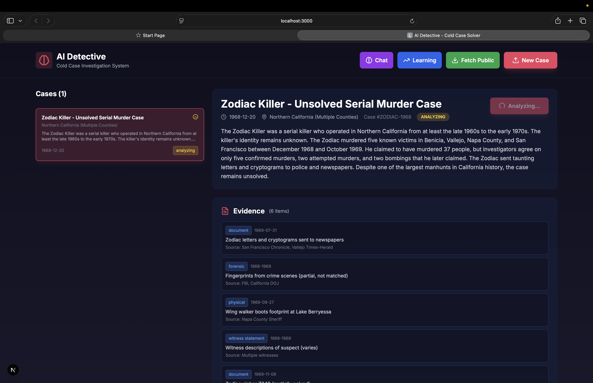
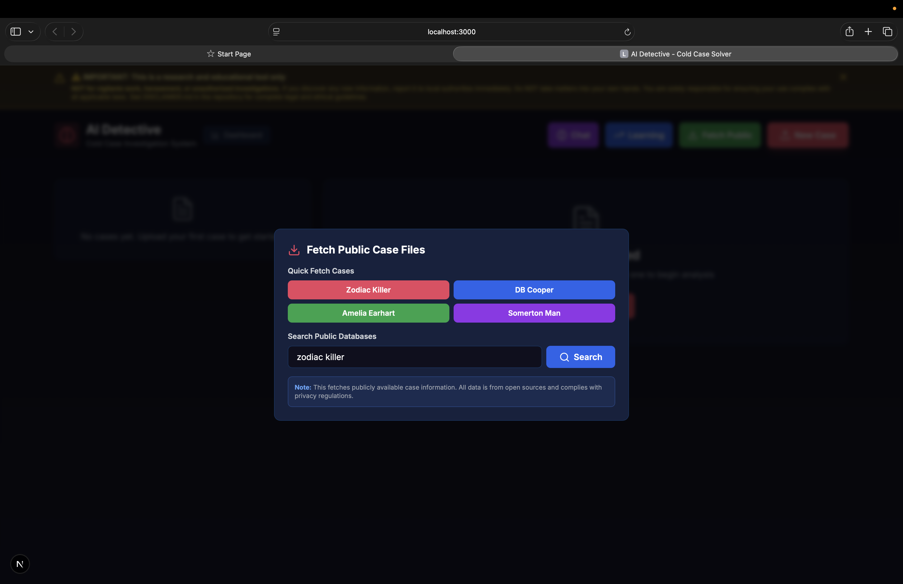
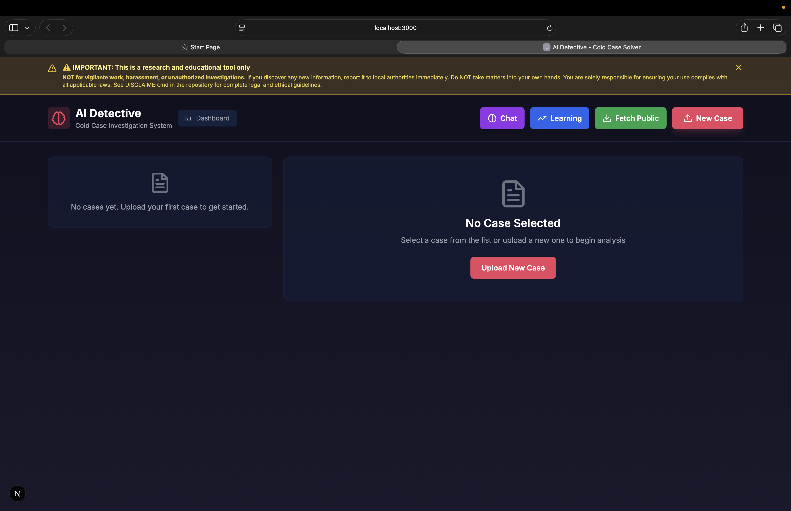

AI Detective - Free Open-Source Investigative Analysis Platform

AI Detective is a free, open-source investigative analysis platform. Anyone can run it locally, explore famous cold cases, experiment with AI reasoning, and contribute new analysis modules.

Think of it as an AI reasoning sandbox, a pattern recognition playground, and an open-source investigative toolkit all in one. Perfect for researchers, students, hobbyists, and anyone curious about how AI can analyze complex information.

IMPORTANT DISCLAIMER

This is a research and educational tool. It is NOT for vigilante work, harassment, or taking the law into your own hands.

Do NOT use this tool for vigilante activities, harassment, or unauthorized investigations
Intended for research, education, and legitimate authorized investigations only
You are solely responsible for ensuring your use complies with all applicable laws
If you discover any new information, report it to local authorities immediately. Do NOT take matters into your own hands.

See DISCLAIMER.md for complete legal and ethical guidelines.

Try It Now

Get up and running in seconds with our automated setup:

Mac/Linux:
git clone https://github.com/SilkForgeAi/AI-detective.git
cd AI-detective
./quick-start.sh

Windows:
git clone https://github.com/SilkForgeAi/AI-detective.git
cd AI-detective
quick-start.bat

Or manually:
git clone https://github.com/SilkForgeAi/AI-detective.git
cd AI-detective
npm install
npm run dev

Then open http://localhost:3000 and start exploring.

The quick-start script automatically:
- Installs dependencies
- Sets up environment variables
- Checks Ollama installation
- Starts the development server

For detailed setup including Ollama configuration, see QUICK_START.md

Application Interface

The clean, modern interface makes it easy to explore cases, run analysis, and interact with the AI detective.

Why This Exists

AI Detective exists to make advanced AI reasoning accessible to everyone. It's a free, transparent, ethical platform for exploring how AI can analyze complex information, detect patterns, and reason through problems.

Whether you're a researcher studying AI reasoning systems, a student learning about pattern recognition, a hobbyist fascinated by unsolved mysteries, or a developer building analysis tools, AI Detective is your playground.

Key Principles

Free and Open Source: MIT licensed, no cost, no restrictions
Local and Private: Runs fully offline with Ollama, no data leaves your machine
No Account Required: Use it immediately, no signup needed
Public Cases Included: Explore legendary mysteries like Zodiac Killer, DB Cooper, Amelia Earhart, and Somerton Man
Community Driven: Built by contributors, for contributors

What You Can Do

Explore Legendary Unsolved Mysteries

Dive into some of history's most fascinating cold cases:
Zodiac Killer: The cryptic serial killer who taunted police
DB Cooper: The mysterious hijacker who vanished into thin air
Amelia Earhart: The aviation pioneer who disappeared over the Pacific
Somerton Man: The unidentified man with the Tamam Shud mystery

Each case comes with evidence, timelines, and the ability to run AI analysis. Use the "Fetch Public Case" feature to instantly load famous cases with all their evidence and metadata.

Experiment with AI Reasoning

Watch AI think through problems step-by-step:
Chain-of-thought reasoning with self-reflection
Quality scoring of reasoning (0-10 scale)
Self-validation and self-correction
Learning from feedback to improve accuracy

This is a living lab for understanding how AI reasoning works.

Play with Pattern Recognition

See advanced algorithms in action:
Serial offender pattern detection
Geographic clustering analysis
Temporal series identification
Evidence chain linking
Suspect description matching

Perfect for learning how pattern matching algorithms work.

Build and Extend

The platform is built for extension:
Plugin architecture for custom modules
Open API for integrations
Modular codebase for easy contributions
Example plugins to learn from

Core Features

AI Reasoning Engine

Self-reasoning AI with chain-of-thought analysis, self-reflection, validation, and quality scoring. Watch the AI think through problems step-by-step and see how it evaluates its own reasoning.

Pattern Recognition System

Advanced pattern matching across cases with serial offender detection, geographic clustering, temporal analysis, evidence chains, and suspect linking. See how algorithms identify connections humans might miss.

Learning System

The AI learns from feedback to improve accuracy. Track learning metrics, provide feedback on analysis quality, and watch the system get smarter over time.

Analysis Tools

Comprehensive analysis capabilities including anomaly detection, hypothesis generation, timeline reconstruction, 3D globe visualization with satellite imagery and terrain, geographic mapping, and evidence tracking. All with confidence scores and reasoning chains.

Natural Language Chat

Chat with the AI detective about your cases. Ask questions, get insights, and explore analysis results through natural conversation. Context-aware responses powered by local Llama models.

Case Management

Upload cases, organize evidence, track timelines, visualize locations on an interactive 3D globe with satellite imagery, terrain, and buildings, and manage your investigative workspace. Full CRUD operations with search, filter, and export capabilities. View comprehensive case details, evidence lists, and run AI analysis with a single click.

Collaboration Features

Case comments, bookmarks, sharing, activity feeds, and notifications. Work alone or collaborate with others. All optional, all free.

User Experience

Modern, intuitive interface with keyboard shortcuts, toast notifications, dashboard statistics, saved searches, and export functionality. Designed for both casual exploration and serious analysis.

Privacy and Ethics

Runs fully local with Ollama. No data leaves your machine. All analysis includes confidence scores and reasoning. Built-in anonymization and ethical safeguards. See ETHICS.md for detailed guidelines.

Getting Started

Quick Start

1. Clone and install:
git clone https://github.com/Silkforgeai/ai-detective.git
cd ai-detective
npm install

2. Set up environment (create .env.local):
USE_LLAMA=true
OLLAMA_BASE_URL=http://localhost:11434
LLAMA_MODEL=llama3.2

3. Set up Cesium assets (for 3D globe):
mkdir -p public/cesium
cp -r node_modules/cesium/Build/Cesium/* public/cesium/

4. Start Ollama (if using local AI):
ollama serve
ollama pull llama3.2

5. Run the app:
npm run dev

6. Open http://localhost:3000

That's it. No account needed. Start exploring immediately.

Note: See CESIUM_SETUP.md for detailed 3D globe setup instructions.

Prerequisites

Node.js 18+ and npm
Ollama for local AI (optional, can use OpenAI API key instead)

For detailed setup, see SETUP_OLLAMA.md

Usage Examples

Explore a Famous Case

1. Click "Fetch Public" button
2. Select "Zodiac Killer" (or DB Cooper, Amelia Earhart, Somerton Man)
3. Case imports automatically with evidence and timeline
4. Click "Run AI Analysis" to see pattern recognition in action
5. Explore insights, hypotheses, and intelligent patterns
6. Chat with the AI about the case

Upload Your Own Case

1. Click "New Case" button
2. Fill in case details (title, date, description, jurisdiction)
3. Add evidence items with types and descriptions
4. Upload files (PDFs, images with OCR support)
5. Run AI analysis to get pattern matches and insights
6. Export results to PDF or JSON

Explore Locations in 3D

1. Run analysis on a case with location data
2. Navigate to the "Case Locations" section
3. Switch between 3D Globe view and List view
4. Interact with the globe: zoom, pan, rotate
5. Click location markers to see details
6. View satellite imagery, terrain, and buildings

Experiment with AI Reasoning

1. Run analysis on any case
2. Click "View Reasoning" to see the AI's step-by-step thought process
3. Review quality scores and self-reflection
4. Provide feedback to help the AI learn
5. Track learning metrics in the Learning Dashboard

Build a Plugin

1. Check out lib/plugins/examples/ for plugin templates
2. Create your own analysis module
3. Register it in the plugin system
4. Share it with the community

Tech Stack

Frontend: Next.js 16, React 18, TypeScript, Tailwind CSS
Backend: Next.js API Routes, Node.js
Database: SQLite with Drizzle ORM (runs locally, no server needed)
AI: Ollama (Llama 3.2) with OpenAI fallback
File Processing: Tesseract.js (OCR), pdf-parse
3D Globe: CesiumJS with Resium (satellite imagery, terrain, buildings)
Maps: Leaflet, React-Leaflet
Notifications: react-hot-toast
Keyboard Shortcuts: react-hotkeys-hook
PDF Export: jsPDF
Search: Fuse.js

All open-source, all free.

Project Structure

app: Next.js app directory with pages and API routes
components: React components for UI
lib: Core libraries (analysis, learning, reasoning, plugins)
types: TypeScript type definitions
scripts: Utility scripts for testing and data fetching
docs: Documentation files

Key Components

Analysis Engine: Pattern matching, anomaly detection, hypothesis generation
Reasoning Engine: Self-reasoning with chain-of-thought and validation
Learning System: Feedback loops and accuracy tracking
Privacy System: Anonymization and ethical safeguards
Plugin System: Extensible architecture for custom modules

Configuration

Environment Variables

USE_LLAMA: Set to true to use local Ollama (default: true if no OpenAI key)
OLLAMA_BASE_URL: Ollama server URL (default: http://localhost:11434)
LLAMA_MODEL: Model name (default: llama3.2)
OPENAI_API_KEY: OpenAI API key (optional, used as fallback)

Database

SQLite database created automatically at ai-detective.db. No setup required. For production, you can switch to PostgreSQL or MongoDB.

Scripts

npm run dev: Start development server
npm run build: Build for production
npm run start: Start production server
npm run lint: Run ESLint
npm run fetch:zodiac: Fetch Zodiac Killer case data
npm run fetch:samples: Generate sample cases
npm run test:patterns: Test pattern recognition algorithms

Contributing

We welcome contributions from everyone. This is a community project, and your ideas, code, and feedback make it better.

Good First Issues

Looking for a place to start? Try these:
Add a new public case (see lib/data/fetchPublicCases.ts)
Create a new analysis plugin (see lib/plugins/examples/)
Improve documentation
Add UI improvements
Write tests
Fix bugs

How to Contribute

1. Fork the repository
2. Create a feature branch: git checkout -b feature/amazing-feature
3. Make your changes
4. Test your changes
5. Commit: git commit -m 'Add amazing feature'
6. Push: git push origin feature/amazing-feature
7. Open a Pull Request

Areas for Contribution

New analysis algorithms
Additional public case data sources
UI/UX improvements
Documentation improvements
Plugin development
Test coverage
Bug fixes
Performance optimizations
Internationalization

See CONTRIBUTING.md for detailed guidelines.

Ethics and Privacy

AI Detective is designed with ethical considerations:

Privacy First: All data is anonymized by default
Public Data Only: Only processes publicly available information
Human-in-the-Loop: AI suggestions require human verification
Transparency: All analysis includes confidence scores and reasoning
Audit Trails: Complete logging of all AI actions
Bias Mitigation: Built-in checks for potential biases
Local Processing: Runs fully offline, no data leaves your machine

See ETHICS.md for detailed guidelines.

License

This project is licensed under the MIT License - see the LICENSE file for details.

Free to use, free to modify, free to distribute.

Support

Issues: GitHub Issues at https://github.com/Silkforgeai/ai-detective/issues
Discussions: GitHub Discussions at https://github.com/Silkforgeai/ai-detective/discussions
Documentation: See /docs folder

Roadmap

Completed

Core case management
AI analysis with pattern recognition
Self-reasoning system
Learning system with feedback
Database persistence
File upload & OCR
Timeline visualization
Geographic mapping
Search & filter
Export & reporting
User authentication (optional)
Natural language querying and chat
Case comparison
Public case fetching (Zodiac, DB Cooper, Amelia Earhart, Somerton Man)
Advanced pattern recognition
Intelligent pattern analysis
Case comments and collaboration
Case bookmarks
Case sharing
Dashboard with statistics
Notifications system
Activity feed
Saved searches
Keyboard shortcuts
Toast notifications
Chat export functionality
Reasoning viewer
Intelligent patterns viewer
Feedback system
Learning dashboard
Plugin system foundation
Free public access (no login required for core features)

Planned

Plugin marketplace and ecosystem
Domain expansion (fraud, cyber, corporate investigations)
Enterprise features (SSO, LDAP, multi-tenant)
Enhanced bias detection and mitigation
Integration with public databases (NamUs, ViCAP)
Multi-user collaboration features
Fine-tuning Llama models on collected data
Mobile app
API documentation
Advanced visualization tools
Self-hosted appliance deployment

Strategic Opportunities

See STRATEGIC_ROADMAP.md for:
General Investigative Intelligence Engine - Expand beyond cold cases
Plugin Architecture Ecosystem - Transform into a platform
Self-Hosted Intelligence Appliance - Enterprise deployment option

Acknowledgments

Built with Next.js
AI powered by Llama and OpenAI
Inspired by real-world cold case investigations
Designed for ethical use and open research

Made with love for justice, truth, and open-source community
